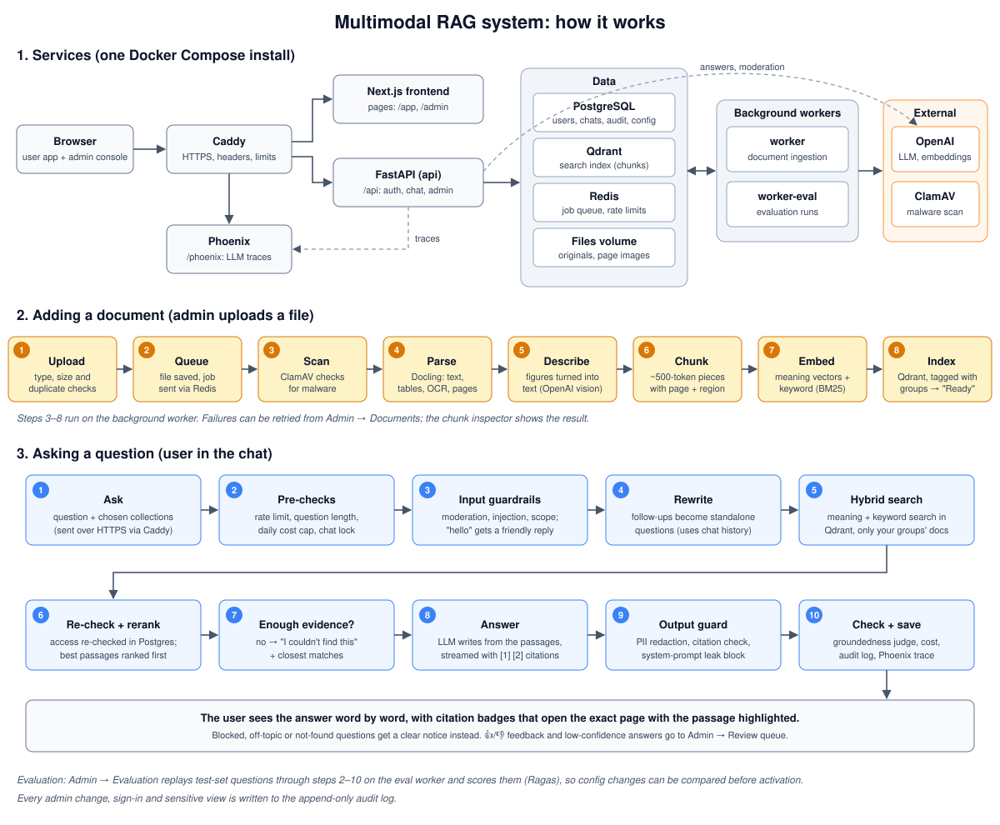

# Multimodal RAG system

An enterprise knowledge assistant. Staff upload documents (PDF, Office files, Markdown, images); the system scans them for malware, extracts text, tables and figures, indexes them with hybrid dense and sparse retrieval, and answers questions with citations that open the exact source page with the cited passage highlighted. Access is controlled per collection through groups, answers stream token by token, every sensitive action is audited, and an admin console covers documents, users and groups, guardrails, evaluation runs, settings and cost. Traces of every LLM call go to Phoenix. The full design is in `docs/superpowers/specs/2026-10-04-multimodal-rag-v1-design.md`.

## How it works



### The pieces

- **Caddy** is the front door. Every request arrives over HTTPS; Caddy sends pages to the **Next.js frontend** and `/api/...` calls to the **FastAPI** backend, and protects the **Phoenix** tracing page with a password.
- **PostgreSQL** stores users, groups, collections, conversations, settings and the audit log. **Qdrant** holds the search index. **Redis** carries background jobs and rate limits. Uploaded files and page images live in the **files volume**.
- Two **background workers** do the slow work: `worker` processes uploaded documents, `worker-eval` runs evaluation test sets.
- **OpenAI** provides the language model, embeddings, image descriptions and moderation. **ClamAV** scans every upload for malware.

### Adding a document

1. An admin uploads files to a collection (Admin → Documents). The API checks the file type, the size (up to 100 MB each) and whether the same file is already there.
2. The file is saved and a job is queued. The document shows its live status in the admin console.
3. The worker scans it for malware, then **Docling** extracts the text, tables and page layout (with OCR for scans and images).
4. Figures and charts are described in words by an OpenAI vision model, so they can be found by search too.
5. The content is split into chunks of about 500 tokens. Each chunk remembers its page and the region on that page.
6. Each chunk gets two search representations, a meaning vector (OpenAI embeddings) and keywords (BM25), and is stored in Qdrant together with the groups allowed to see it. The document is now **Ready**.

### Asking a question

1. A user asks a question in the chat, optionally limited to some collections.
2. **Pre-checks:** rate limit, question length, daily cost cap and any chat lock.
3. **Input guardrails:** content moderation, prompt-injection and scope checks. Greetings like "hello" or "thanks" get a short friendly reply without searching.
4. A follow-up ("and for part-time staff?") is rewritten into a standalone question using the conversation.
5. **Hybrid search** finds the most relevant chunks by meaning and by keywords, only in documents the user's groups can see.
6. Access is re-checked in PostgreSQL, and a reranker puts the best passages first.
7. If nothing is relevant enough, the answer is "I couldn't find this in the available documents", with the closest matches shown. The system never makes an answer up.
8. Otherwise the language model writes an answer **only from those passages**, citing them as [1], [2]. It streams to the browser word by word.
9. An **output guard** redacts personal data that isn't in the sources, drops citations that don't match a real source, and blocks answers that leak the system prompt.
10. A judge checks that the answer is supported by the sources (otherwise it shows a *Low confidence* badge). The cost is recorded, the trace goes to Phoenix, and the message is saved.

Clicking a citation badge opens the source page with the cited passage highlighted. 👍/👎 feedback, low-confidence answers and guardrail flags go to **Admin → Review queue**, where an admin can add them to a test set. **Admin → Evaluation** replays a test set through the same pipeline and scores it, so a change to models, prompts or guardrails can be compared before it is activated.

## Requirements

- Docker with Compose 2.17 or later.
- Medium install: 4 vCPU and 16 GB RAM. Large install: 8 vCPU, 32 GB RAM and 500 GB SSD (spec section 8.3).
- An OpenAI API key (embeddings, figure descriptions, moderation, answers).
- A DNS name pointing at the host with ports 80 and 443 open, if you want a public Let's Encrypt certificate.

## Install

1. Create your settings file:

   ```bash
   cp deploy/.env.example deploy/.env
   ```

2. Fill in `deploy/.env`. Each secret has its generating command in the file: `RAG_JWT_SECRET` (`secrets.token_urlsafe`), `RAG_SECRETS_KEY` (a Fernet key), and `POSTGRES_PASSWORD` and `PHOENIX_DB_PASSWORD` (letters and digits only, they are embedded in URLs). Set `RAG_OPENAI_API_KEY`. Create the Phoenix basic-auth hash with `docker run --rm caddy:2.10.2-alpine caddy hash-password --plaintext 'your-password'` and keep the single quotes in the file.

   `RAG_DOMAIN` has three modes:
   - A public DNS name: Caddy obtains and renews a Let's Encrypt certificate automatically.
   - `localhost` or an intranet name: Caddy's internal CA issues the certificate; browsers warn until it is trusted.
   - `:80`: plain HTTP. Also set `RAG_SESSION_COOKIE_SECURE=false`, otherwise the browser will not send the session cookie. Use this only behind another TLS terminator or on a trusted network.

   `HTTP_PORT` and `HTTPS_PORT` change the published ports (defaults 80 and 443).

3. Start the stack:

   ```bash
   docker compose -f deploy/docker-compose.yml up -d    # or: make up
   ```

   The first build downloads models and takes several minutes; ClamAV can take up to 5 minutes to become healthy.

4. Create the first super admin:

   ```bash
   make create-superadmin           # Windows: bash scripts/create-superadmin.sh
   ```

   The script prompts for username, full name and password. For automation set `RAG_SUPERADMIN_USERNAME`, `RAG_SUPERADMIN_FULL_NAME` and `RAG_SUPERADMIN_PASSWORD`.

5. Open `https://<domain>` and sign in.

## Upgrade

For an install made before Plan 8, do these in order:

1. `git pull`.
2. Add the new keys from `deploy/.env.example` to `deploy/.env`: `PHOENIX_DB_PASSWORD`, `PHOENIX_BASIC_AUTH_USER`, `PHOENIX_BASIC_AUTH_HASH` (generate it with `docker run --rm caddy:2 caddy hash-password --plaintext 'your-password'`, keep it single-quoted) and `RAG_DOMAIN`. Add `HTTP_PORT` / `HTTPS_PORT` if ports 80/443 are taken. Compose refuses to run without the required (`:?`) keys.
3. `docker compose -f deploy/docker-compose.yml up -d postgres`
4. `make phoenix-db` (Windows: `bash scripts/phoenix-db.sh`) creates the Phoenix database and role.
5. `make up` for production, or `make dev` for development (API on `127.0.0.1:8000` and Phoenix on `127.0.0.1:6006`, since the base compose no longer publishes them).
6. Optional: once the old traces aren't needed, drop the old `phoenix` schema from the app database: `docker compose -f deploy/docker-compose.yml exec postgres psql -U rag -d rag -c 'DROP SCHEMA phoenix CASCADE;'`. It isn't migrated and is otherwise included in every app backup.

Caddy now needs host ports 80/443 (or `HTTP_PORT` / `HTTPS_PORT`). Database migrations run automatically when the API starts.

## Backup and restore

```bash
make backup                              # writes backups/<UTC timestamp>/
make restore BACKUP=backups/<folder>
```

A backup holds a Postgres dump, a Qdrant snapshot of the chunk collection and an archive of the files volume (originals, page images, logo). A backup taken while ingestion runs can be slightly inconsistent, because the dump, the snapshot and the files are taken one after another. For a strictly consistent backup, stop the workers first (`docker compose -f deploy/docker-compose.yml stop worker worker-eval`) and start them again afterwards. Restore replaces the current data; scripts ask for confirmation (`--yes` skips it).

Schedule it with cron, for example `0 2 * * * cd /opt/rag && make backup`, and copy the folders off the host.

**Back up `deploy/.env` separately.** It is not part of the backup, and `RAG_SECRETS_KEY` is needed to read API keys saved in admin Settings. Without it they must be entered again.

## Operations

- Logs: `make logs` or `docker compose -f deploy/docker-compose.yml logs -f <service>`. Backend logs are JSON and carry a request ID; Caddy overwrites any client-supplied `X-Request-ID`, so audit rows can be trusted.
- Phoenix (LLM traces): `https://<domain>/phoenix`, behind basic auth (`PHOENIX_BASIC_AUTH_USER` / `PHOENIX_BASIC_AUTH_HASH`).
- Traces: in Phoenix, filter spans by the trace id shown in the console.
- Health: `docker compose -f deploy/docker-compose.yml ps` (every service should be `healthy` or `running`); `GET /api/health` for the API; the admin dashboard shows database, Qdrant and Redis.
- Limits: 100 MB per file and 500 MB per upload request; other API requests are capped at 10 MB.

## Development

- `make dev` starts only the backend services with the API on port 8000 and Phoenix on 6006 (Caddy and the frontend aren't started; the `PHOENIX_BASIC_AUTH_*` keys must still exist in `deploy/.env`, the `.env.example` placeholders are fine).
- Frontend: in `frontend/`, `npm run dev`. See `frontend/README.md`.
- Backend tests: `cd backend && uv run pytest` (needs Docker for testcontainers). Also `uv run ruff check .`, `uv run ruff format --check .` and `uv run mypy`.
- Frontend checks: `npm test`, `npm run lint`, `npm run typecheck`, `npm run build`.
- End-to-end tests: `cd frontend && E2E_BASE_URL=... E2E_USERNAME=... E2E_PASSWORD=... npm run e2e` against a running stack with a super admin. The global setup seeds a group, a collection and a leave-policy PDF. For a self-signed certificate add `E2E_IGNORE_HTTPS_ERRORS=1`.

## CI

GitHub Actions runs on every push: backend ruff, mypy and pytest; frontend lint, typecheck, tests and build; and a build of the backend and frontend images. The e2e tests are manual because they need a running stack and an OpenAI key.

## Security notes

- Everything is served over HTTPS by Caddy, with HSTS, a strict Content-Security-Policy, `X-Frame-Options: DENY` and no `Server` header.
- State-changing API calls need the `X-CSRF-Protection` header, and the session cookie is HTTP-only.
- Phoenix is reachable only through Caddy and only with basic auth; its port is not published.
- Destructive admin actions (deleting documents or collections, changing access, saving API keys) require the admin to re-enter their password.
- Uploads are scanned by ClamAV before processing.

## Repository layout

- `backend/`: FastAPI API, Celery workers (ingestion and evaluation), migrations and tests.
- `frontend/`: Next.js app (chat and admin console) and the Playwright e2e tests.
- `deploy/`: `docker-compose.yml`, the dev override, the `Caddyfile`, Postgres init scripts and `.env.example`.
- `scripts/`: backup, restore, super admin and Phoenix database helpers (Git Bash friendly).
- `docs/superpowers/`: the design spec, the implementation plans and their follow-ups.

## Troubleshooting

- The stack looks stuck on first start: ClamAV downloads its signatures and can take up to 5 minutes to become healthy; the workers wait for it.
- The browser warns about the certificate: with `localhost` or an intranet name Caddy uses its own CA. Trust it or use a public DNS name.
- Login works but you are signed out at once on plain HTTP: set `RAG_SESSION_COOKIE_SECURE=false` (only with `RAG_DOMAIN=:80`).
- Saved API keys show as unreadable: `RAG_SECRETS_KEY` changed. Restore the original from your separate `deploy/.env` backup, or enter the keys again in Settings.
- Docker needs several GB of free disk for the first build (the backend image bundles models).
